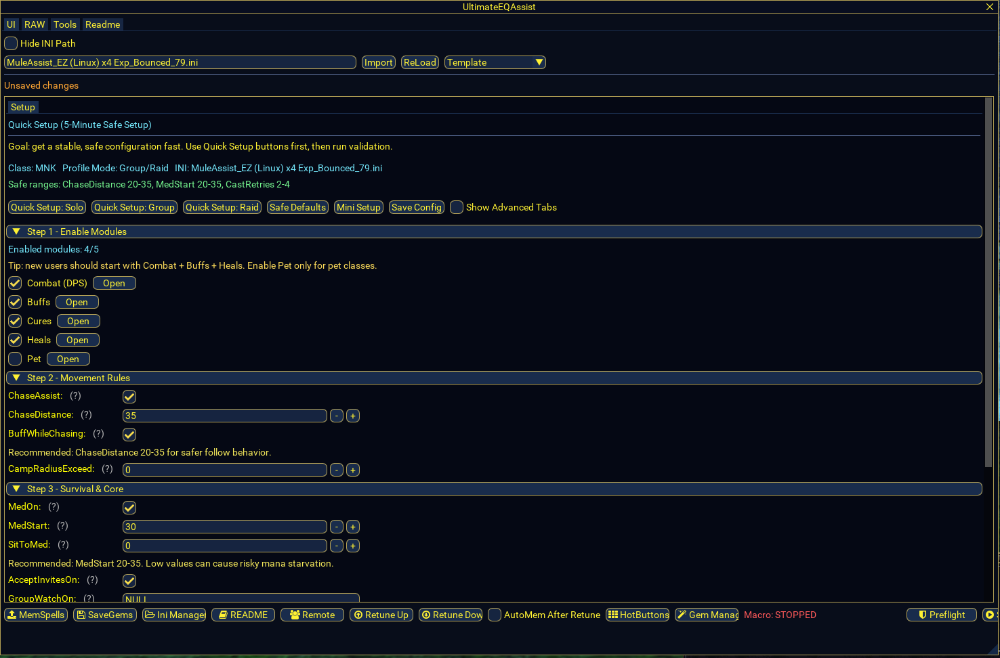
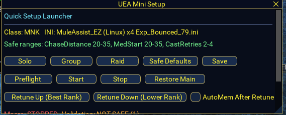
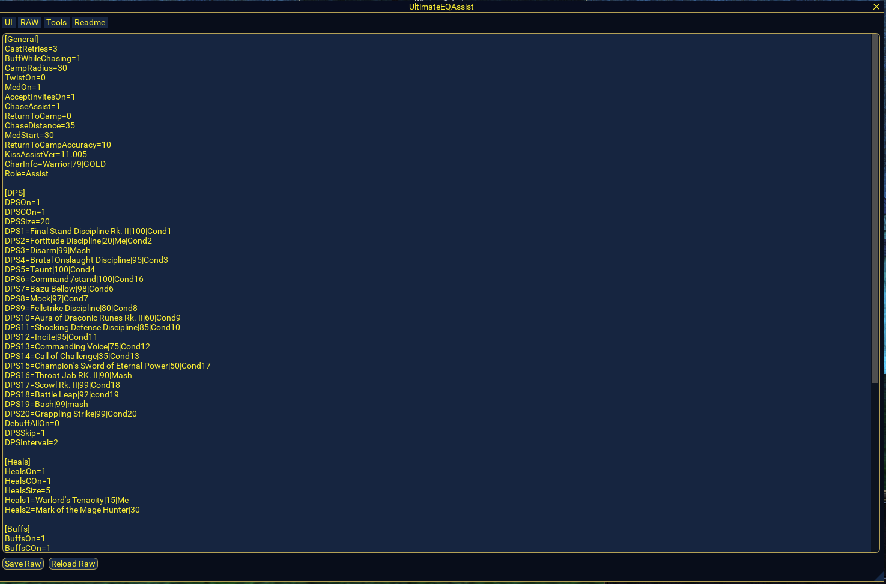
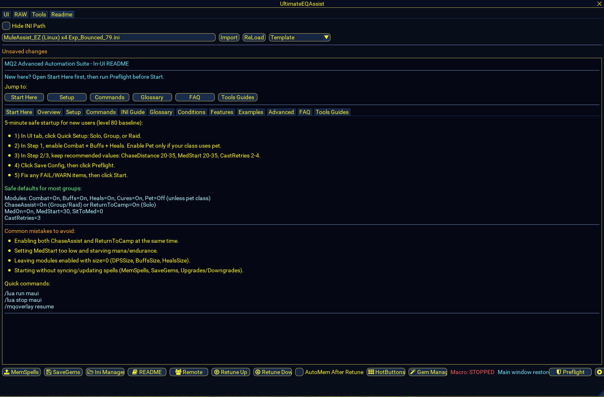
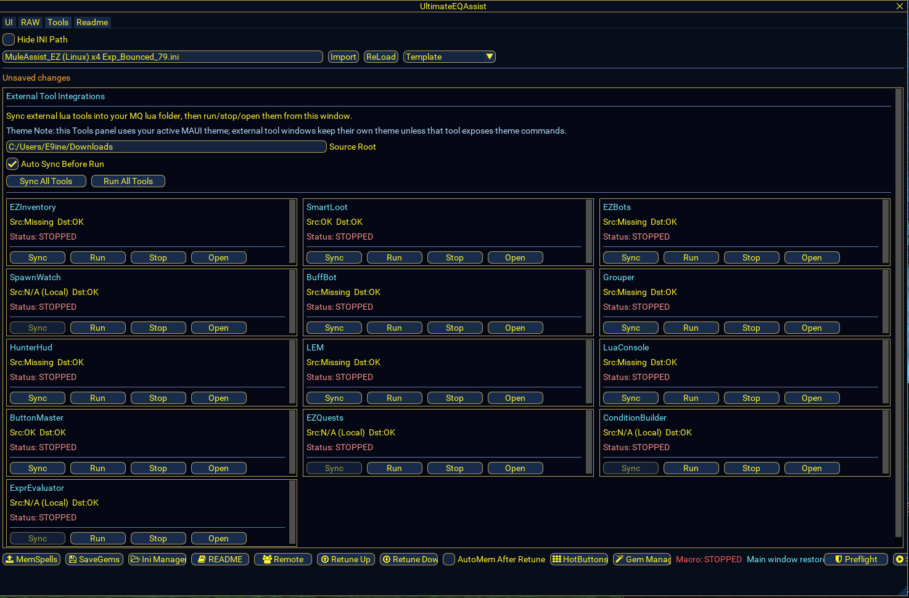

# MAUI + Attached Tool Suite

A complete shareable package of **MAUI** and its attached Lua tools for MacroQuest (MQ).

This repository is organized so you can copy the `lua/` contents directly into your MQ `lua` folder.

## What This Includes

### Core
- `lua/maui`
  - MAUI main UI (`init.lua`) for MuleAssist profile editing and tool launch/sync control.
  - MAUI schemas, addons, config helpers, and local utility libs.

### Attached Tools (from MAUI Tools tab)
- `lua/EZInventory`  
  Inventory browser, assignment workflow, upgrade checks, augment/focus tools, peer views.
- `lua/smartloot`  
  Rule-driven looting engine, peer coordination, directed assigns, loot stats/history UI.
- `lua/ezbots`  
  Peer control and command/broadcast helper toolkit.
- `lua/spawnwatch`  
  Spawn query/editor and viewer windows.
- `lua/buffbot`  
  Class-based buff/utility bot with event-driven requests and GUI.
- `lua/grouper`  
  Group composition and control helper utility.
- `lua/hunterhud`  
  Hunting/zone assist HUD tool.
- `lua/lem`  
  Lua Event Manager (event/template automation framework).
- `lua/luaconsole`  
  In-game Lua console UI.
- `lua/buttonmaster`  
  Custom button/hotbar builder with icon picker and theme support.
- `lua/condition_builder.lua`  
  Standalone condition/rule builder UI.
- `lua/expression_evaluator.lua`  
  Standalone expression evaluator UI.

### Shared Libraries Included
- `lua/lib/maui_theme_bridge.lua` and related helper modules used by attached tools.
- `lua/mq/*` helper modules bundled by this tool set.

## Not Included
- `EZQuests` source is referenced by MAUI but is **not present** in this package snapshot.
  - MAUI has run/open commands for it (`/lua run ezquests`, `/ezq show`), but you need to add that tool separately if you use it.

## Quick Install

1. Stop related scripts first:
   - `/lua stop maui`
   - `/lua stop ezinventory`
   - `/lua stop smartloot`
   - (and any other running tools)
2. Copy this repo's `lua/` contents into your MQ `lua` directory.
3. Launch MAUI:
   - `/lua run maui`
4. Open MAUI -> **Tools** tab and run/open tools as needed.

## Core Commands

### MAUI
- `/lua run maui`
- `/maui show`
- `/maui hide`
- `/maui stop`

### Common Tool Launch Commands
- `/lua run ezinventory`
- `/lua run smartloot`
- `/lua run ezbots`
- `/lua run spawnwatch`
- `/lua run buffbot`
- `/lua run grouper`
- `/lua run hunterhud`
- `/lua run lem`
- `/lua run luaconsole`
- `/lua run buttonmaster`
- `/lua run condition_builder`
- `/lua run expression_evaluator`

## Tool Purpose Cheat Sheet

- **MAUI**: MuleAssist profile editor + safety/start workflow + integrated launcher/sync UI.
- **EZInventory**: inventory management, peer item visibility, assignments, augment/focus checks.
- **SmartLoot**: configurable loot logic (rules, peers, waterfall/directed flows, debugging/stats).
- **EZBots**: peer command orchestration and utility actions.
- **SpawnWatch**: spawn query and display tools for monitoring targets.
- **BuffBot**: responds to requests and automates class buff utility patterns.
- **Grouper**: group utility and management operations.
- **HunterHud**: hunting HUD overlays and hunt-assist context.
- **LEM**: trigger/event framework with templates for scripted reactions.
- **LuaConsole**: in-game Lua command execution and output panel.
- **ButtonMaster**: customizable in-game action bars/buttons.
- **Condition Builder**: visual helper for writing/testing conditional logic.
- **Expression Evaluator**: evaluate MQ/Lua expressions quickly while tuning scripts.

## Suggested GitHub Repo Structure

- `lua/` (all scripts and tools)
- `docs/` (screenshots and deeper guides)
- `README.md` (this file)

## Screenshots

### MAUI Setup Tab

### MAUI Mini Setup Window

### MAUI RAW Tab

### MAUI In-UI README Tab

### MAUI Tools Integrations Tab

## Compatibility Notes

- Built for modern MacroQuest Lua runtime and ImGui APIs.
- Some tools depend on your emulator/server data/plugins and may require per-server config.
- If a tool fails to open, run it directly once (`/lua run <tool>`) and check MQ output for missing dependency messages.

## Credits / Source Notes

This package was assembled from your current MAUI workspace and attached tool modules present locally.

Original Author of Maui = aquietone (My version highly edited/altered, arguably better)
https://www.redguides.com/community/resources/maui-muleassist-ui.2207/

Special Thanks for Spawnwatch, Ezinventory, Smartloot (some ive revamped a tad for person reasons) = Andude2
- EZBots: https://github.com/andude2/EZBots
- SmartLoot: https://github.com/andude2/smartloot
- EZInventory: https://github.com/andude2/EZInventory

Grouper Lua Source Credit = Vanders
https://www.redguides.com/community/resources/grouper.2636/

Original Author Button Master = Special Ed
https://www.redguides.com/community/resources/button-master.2174/

LUA Console = Derple (Highly revamped from original)
https://www.redguides.com/community/resources/lua-console.3170/

Hunter Hud Original Author = Kaen
https://www.redguides.com/community/resources/hunterhud.2339/

